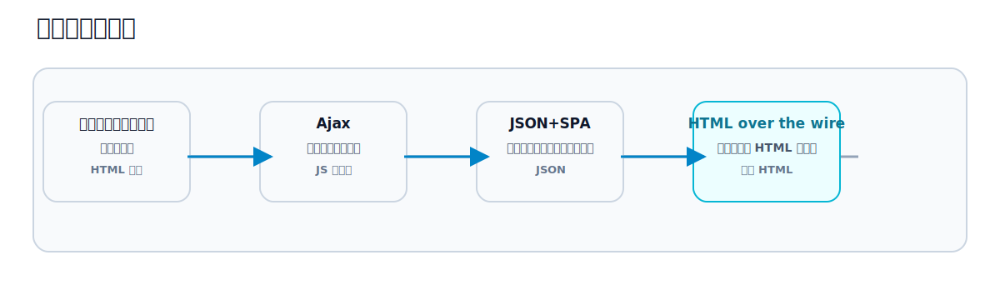
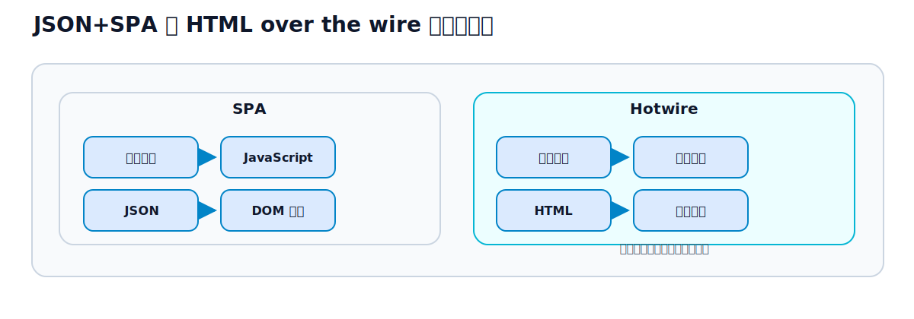

# 第2章 HTML over the wire という考え方

## この章のねらい

第1章で、Hotwire は「サーバーが HTML を送る」設計だと見ました。しかし、なぜ今さら HTML なのでしょうか。Web は、JSON を送る方向へ進んできたはずです。

この章では、Web アプリケーションの画面更新の歴史をたどり、HTML を送る設計が、なぜ現代的な選択肢として見直されているのかを理解します。

## 2.1 Web アプリケーションの画面更新の歴史

最初期の Web は、単純でした。リンクをクリックすると、サーバーが新しいページの HTML を返し、ブラウザがそれを表示する。フォームを送信すると、また新しい HTML が返る。画面更新は、つねに「ページ全体の再読み込み」でした。

この作りは、分かりやすいものでした。サーバーは HTML を返すだけ、ブラウザは表示するだけ。状態はサーバーが持ちます。しかし、操作のたびにページ全体が白く再描画され、もっさりとした体験でした。

## 2.2 Ajax と JSON API の普及

そこで登場したのが Ajax です。ページ全体を再読み込みせず、JavaScript がバックグラウンドでサーバーと通信し、画面の一部だけを更新する。これにより、ページの一部を、滑らかに書き換えられるようになりました。

通信でやり取りするデータは、次第に JSON が主流になりました。サーバーは JSON でデータを返し、ブラウザの JavaScript が、その JSON を使って画面を組み立てる。サーバーは「データの供給源」、画面作りは「ブラウザの仕事」、という分業が進みました。

## 2.3 SPA が解決したこと、増やしたこと

この分業を、突き詰めたのが SPA（Single Page Application）です。最初に一度だけページを読み込み、あとはすべて JavaScript が、JSON をもとに画面を描き替えます。ページ遷移すら、JavaScript が担います。

SPA は、多くを解決しました。ネイティブアプリのような滑らかな操作感、複雑なクライアント側の表現。これらは、SPA の大きな成果です。

一方で、増やしたものもあります。<strong>複雑さ</strong>です。画面を組み立てる責任が、サーバーからブラウザへ移ったことで、JavaScript の量が増えました。状態をブラウザ側に持つので、その管理が要ります。サーバーとクライアントで、データの形（JSON）の取り決めも要ります。同じような検証を、サーバーとクライアントの両方に書くことも起きます。多くのアプリにとって、この複雑さは、得られる体験に見合わないことがありました。

## 2.4 HTML を送ることの再評価

ここで、振り出しに戻る発想が出てきます。「画面は HTML なのだから、サーバーが HTML を送ればよいのではないか」。

ただし、最初期のように「ページ全体を再読み込み」するのではありません。Ajax の良いところ（部分更新）は活かしつつ、やり取りするのを JSON ではなく HTML にする。サーバーが、更新したい部分の HTML を送り、ブラウザがそれを差し替える。これが「HTML over the wire」です。

この発想には、利点があります。画面を組み立てるのは、引き続きサーバーです。だから、JavaScript は最小限で済みます。状態も、基本はサーバーが持ちます。検証も、サーバーに一本化できます。SPA が増やした複雑さの多くを、避けられます。Hotwire は、この「HTML を送る部分更新」を、現代的な使い勝手で実現する道具です。

## 2.5 Hotwire が向くアプリケーション

もちろん、HTML over the wire が、すべてのアプリに最適なわけではありません。向き不向きがあります。

向くのは、<strong>サーバーが持つデータを見せ、操作するのが中心のアプリ</strong>です。一覧、詳細、作成、編集が主な操作で、画面の状態の多くがサーバー側にある。多くの業務アプリや管理画面、コンテンツ中心のサイトが、これに当てはまります。本書で作る Relay も、その典型です。

逆に、ブラウザ側で重い状態を扱うアプリ（描画ツール、表計算など）や、オフラインで動く必要があるアプリは、SPA の方が向きます。この使い分けは、第10部で改めて詳しく扱います。

> 第2章では、HTML を送る設計が見直されている背景を、歴史からたどりました。次の第3章では、この考え方が、なぜ Rails ととりわけ相性がよいのかを見ます。

## 参考資料

- Turbo: <https://turbo.hotwired.dev/>
- Hotwire: <https://hotwired.dev/>
