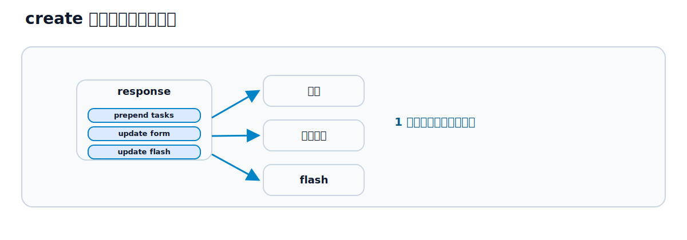

# 第16章 create / update / destroy を Stream 化する

## この章のねらい

第15章で、Turbo Streams は「差し替え命令の入った HTML」だと学びました。この章では、それを Relay の CRUD に組み込みます。タスクの作成・更新・削除を、ページ遷移なしで反映します。

第15章で断片として示した `respond_to` の完全形（成功は stream、失敗は 422）を、ここで仕上げます。第8章の契約（成功は redirect か stream、失敗は 422）が、Streams でもそのまま効きます。

この章では、一覧画面が次の構造になっている前提で進めます。

`app/views/tasks/index.html.erb`（抜粋）

```erb
<div id="flash"><%= render "layouts/flash" %></div>

<div id="new_task_form">
  <%= render "form", task: @task %>
</div>

<div id="tasks">
  <%= render @tasks %>
</div>
```

`id="tasks"` がタスク一覧の入れ物、`id="new_task_form"` が新規作成フォームの入れ物、`id="flash"` がフラッシュの入れ物です。各タスクは、第12章の `_task`（`id="task_1"` の frame）で描かれます。`index` アクションでは、一覧用の `@tasks` と、新規フォーム用の `@task = Task.new` を用意しておきます。

なお本書は、Turbo が有効な前提で進めます。各アクションには通常の HTML を返す `format.html` も書きますが、これは Turbo が使えないクライアント向けのフォールバックです。Turbo 経路と HTML 経路で挙動が食い違わないよう、フラッシュの渡し方や失敗時の戻し先を、経路ごとに揃えておきます。

## 16.1 create 後に prepend する

タスクを作成したら、一覧の先頭に追加します。`create` アクションを Turbo Streams に対応させます。

`app/controllers/tasks_controller.rb`（`create` の成功側）

```ruby
if @task.save
  respond_to do |format|
    format.turbo_stream
    format.html { redirect_to @task }
  end
end
```

`create.turbo_stream.erb` で、命令を組み立てます。

`app/views/tasks/create.turbo_stream.erb`

```erb
<%= turbo_stream.prepend "tasks", @task %>
<%= turbo_stream.update "new_task_form" do %>
  <%= render "form", task: Task.new %>
<% end %>
```

1 つ目の命令は、`id="tasks"` の先頭に、作成したタスク（`_task`）を `prepend` します。2 つ目の命令は、`id="new_task_form"` の中身を、新しい空のフォームに `update` します。これで、フォームを送信すると、一覧の先頭に新しいタスクが現れ、フォームが空に戻ります。ページ遷移は起きません。

ここで第15章のポイントが効いています。<strong>1 つのレスポンスに 2 つの命令</strong>を入れて、一覧とフォームという離れた 2 か所を同時に更新しています。

## 16.2 update 後に replace する

タスクを更新したら、その行だけを新しい内容に差し替えます。`update` アクションの成功側を Turbo Streams に対応させ、`update.turbo_stream.erb` を用意します。

`app/views/tasks/update.turbo_stream.erb`

```erb
<%= turbo_stream.replace @task %>
```

`turbo_stream.replace @task` は、`@task` の `dom_id`（`task_1`）を target に、`_task` を描いて要素ごと差し替えます。第12章で、表示も編集も `id="task_1"` の frame に揃えていたので、その frame がまるごと新しい表示に置き換わります。

`replace` と `update` の違い（第15章）を思い出してください。ここでは行（frame）の要素ごと差し替えたいので `replace` です。

## 16.3 destroy 後に remove する

タスクを削除したら、その行を消します。`destroy.turbo_stream.erb` を用意します。

`app/views/tasks/destroy.turbo_stream.erb`

```erb
<%= turbo_stream.remove @task %>
```

`turbo_stream.remove @task` は、`@task` の `dom_id`（`task_1`）の要素を削除します。`remove` は要素を消すだけなので、中身の HTML は要りません（第15章）。

## 16.4 flash を更新する




操作の結果を、フラッシュで知らせたいこともあります。一覧の入れ物に `id="flash"` を用意してあるので、ここを更新する命令を足します。

まず、controller でフラッシュを設定します。ここで注意が要ります。Turbo Streams の応答ではページ遷移しないので `flash.now` を使いますが、HTML フォールバックは `redirect_to` で遷移するので、リダイレクト後まで残る `flash` を使う必要があります。`flash.now` はそのリクエスト限りで消えるため、リダイレクトでは残りません。そこで、経路ごとに分けて設定します。

`app/controllers/tasks_controller.rb`（`create` の成功側）

```ruby
if @task.save
  respond_to do |format|
    format.turbo_stream do
      flash.now[:notice] = "タスクを作成しました。"
      render :create
    end
    format.html { redirect_to @task, notice: "タスクを作成しました。" }
  end
end
```

`format.turbo_stream` の側では `flash.now` を立ててから `create.turbo_stream.erb` を描き（その中で flash を更新します）、`format.html` の側では `redirect_to` の `notice:` でリダイレクト後に残るフラッシュを渡します。

そして、`create.turbo_stream.erb` に flash を更新する命令を足します。

`app/views/tasks/create.turbo_stream.erb`（追記）

```erb
<%= turbo_stream.update "flash", partial: "layouts/flash" %>
```

これで、作成時に「一覧へ prepend」「フォームを空に update」「flash を update」という 3 つの命令が、1 レスポンスで送られます。第14章で frame では応えられなかった「複数箇所の同時更新」が、これで実現できました。

## 16.5 エラー時はフォームを差し替える

ここまでは成功側でした。失敗側を仕上げます。第8章の契約どおり、失敗時は 422 で返します。Streams の場合は、フォームを「エラー付きのフォーム」に差し替える命令を、422 で返します。

`app/controllers/tasks_controller.rb`（`create` の全体）

```ruby
def create
  @task = Task.new(task_params)
  if @task.save
    respond_to do |format|
      format.turbo_stream do
        flash.now[:notice] = "タスクを作成しました。"
        render :create
      end
      format.html { redirect_to @task, notice: "タスクを作成しました。" }
    end
  else
    respond_to do |format|
      format.turbo_stream do
        render turbo_stream: turbo_stream.update(
          "new_task_form", partial: "tasks/form", locals: { task: @task }
        ), status: :unprocessable_entity
      end
      format.html do
        @tasks = Task.all
        render :index, status: :unprocessable_entity
      end
    end
  end
end
```

失敗側の Turbo Streams は、`id="new_task_form"` の中身を、エラー付きのフォーム（`@task` にはエラーが入っている）に `update` します。ステータスは 422 です。`status: :unprocessable_entity` を付けるのは、第8章で見た契約のためです。Turbo は、422 でも Turbo Streams の応答であれば命令として処理します。

HTML フォールバックの戻し先にも注意します。この章のフォームは一覧ページ（index）に置いた inline フォームなので、失敗時は `:new` ではなく `:index` を 422 で返します。`:new` を返すと、`#flash` / `#new_task_form` / `#tasks` を持つこの章の画面構造から外れてしまうからです。`render :index` ではエラーの入った `@task` がフォームに使われ、一覧用の `@tasks` も必要なので、ここで用意しています。

成功時は一覧に追加、失敗時はフォームをエラー付きに差し替え。どちらもページ遷移せず、必要な場所だけが変わります。

## 16.6 この章の System Test

作成（成功・失敗）と削除を、System Test で確認します。

`test/system/tasks_stream_test.rb`

```ruby
require "application_system_test_case"

class TasksStreamTest < ApplicationSystemTestCase
  setup do
    @project = Project.create!(name: "テスト用プロジェクト")
  end

  test "作成すると一覧の先頭に追加される" do
    visit tasks_path
    fill_in "Title", with: "新しいタスク"
    fill_in "Project", with: @project.id
    click_on "Create Task"

    within "#tasks" do
      assert_text "新しいタスク"
    end
  end

  test "タイトルが空だとフォームにエラーが出る" do
    visit tasks_path
    fill_in "Title", with: ""
    fill_in "Project", with: @project.id
    click_on "Create Task"

    within "#new_task_form" do
      assert_selector "input[name='task[title]']"
      assert_text "prohibited"
    end
  end

  test "削除すると一覧から消える" do
    task = @project.tasks.create!(title: "消されるタスク")
    visit tasks_path

    within "##{dom_id(task)}" do
      click_on "削除"
    end

    assert_no_text "消されるタスク"
  end
end
```

いずれも、ページ遷移せずに一覧やフォームが変わることを確認しています。作成成功は `#tasks` の中に出ること、失敗は `#new_task_form` の中にエラーが出ること、削除は一覧から消えることを、それぞれ見ています。

> 第16章では、CRUD を Turbo Streams で動かし、作成時に複数箇所を同時更新できることを見ました。次の第17章では、その「複数箇所の同時更新」を、件数・空状態・partial 共通化・id 設計の観点で深めます。

## 参考資料

- Turbo Streams（Handbook）: <https://turbo.hotwired.dev/handbook/streams>
- Turbo Streams リファレンス: <https://turbo.hotwired.dev/reference/streams>
- Rails ガイド「Action View の概要」: <https://guides.rubyonrails.org/action_view_overview.html>
