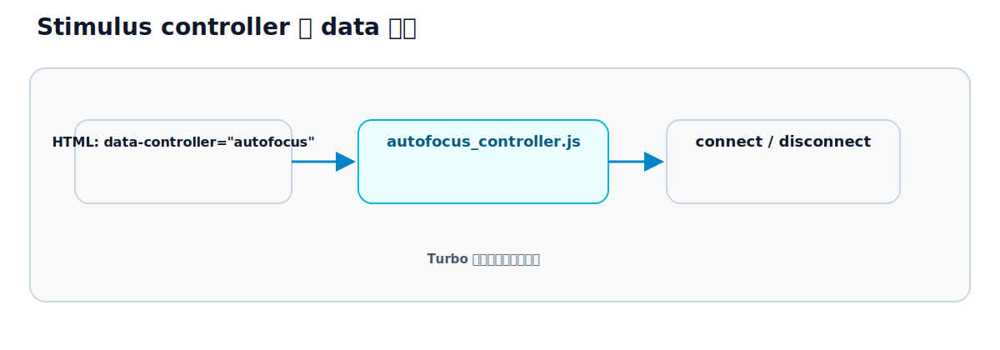

# 第19章 Stimulus の基本

## この章のねらい

第3部から第5部まで、画面の更新はすべてサーバーが担ってきました。リンク、フォーム、Turbo Streams、broadcast。どれも「サーバーが HTML を返し、ブラウザがそれを反映する」仕組みでした。

しかし、サーバーに問い合わせるまでもない振る舞いもあります。メニューの開閉、文字数のカウント、入力欄へのフォーカス。こうした「その場で完結する振る舞い」を担うのが Stimulus です。

この章では、Stimulus の思想と、もっとも基本的な書き方（controller と `data-controller`）、そして Turbo との関係を学びます。

> この部を貫く軸は「Stimulus は HTML に振る舞いを足す。状態は HTML に置く」です。Stimulus はサーバー往復が要らない振る舞いだけを HTML に足し、状態は JavaScript の中ではなく HTML 側（data 属性）に持ちます。だから Turbo がページや frame を差し替えても、振る舞いは保たれます。

## 19.1 Stimulus の思想

Turbo が広まる前、Rails で少し凝った操作を足すときは、ページ読み込み時に JavaScript を実行して、要素を探して、イベントを結びつける、という書き方が一般的でした。

```javascript
document.addEventListener("DOMContentLoaded", () => {
  document.querySelector("#menu-button").addEventListener("click", toggleMenu)
})
```

この書き方には、Turbo と相性が悪い問題があります。Turbo はページを丸ごと再読み込みせず、`<body>` を差し替えて遷移します（第7章）。新しい document を初回ロードするわけではないので、`DOMContentLoaded` は最初の読み込みのときにしか走りません。結果、Turbo で遷移した先では、結びつけたはずの振る舞いが動かなくなります。

Stimulus は、この問題を別の発想で解きます。「どの要素に、どの振る舞いを足すか」を、JavaScript で探しに行くのではなく、<strong>HTML 側に書いておく</strong>のです。

```html
<div data-controller="menu">
  ...
</div>
```

こう書いておくと、Stimulus が `data-controller="menu"` の付いた要素を見つけ、対応する振る舞いを自動で結びつけます。要素が追加されれば結びつけ、取り除かれれば解除します。これは Turbo の差し替えのあとでも自動で働きます。HTML が主役で、JavaScript はそれに従う。これが Stimulus の思想です。

## 19.2 controller

Stimulus の振る舞いは、<strong>controller</strong>という単位で書きます。controller は、`@hotwired/stimulus` の `Controller` を継承した JavaScript のクラスです。

例として、要素にフォーカスを当てるだけの小さな controller を作ります。

`app/javascript/controllers/autofocus_controller.js`

```javascript
import { Controller } from "@hotwired/stimulus"

export default class extends Controller {
  connect() {
    this.element.focus()
  }
}
```

`connect()` は、この controller が要素に結びついたときに呼ばれるメソッドです。`this.element` は、結びついた相手の要素を指します。つまりこの controller は、「結びついたら、その要素にフォーカスを当てる」という振る舞いです。

Rails には Stimulus 用のジェネレータもあります。

```bash
bin/rails generate stimulus autofocus
```

これで `autofocus_controller.js` の雛形が作られます。

## 19.3 data 属性

作った controller を要素に結びつけるには、HTML 側で `data-controller` 属性に controller の名前を書きます。

`app/views/tasks/_form.html.erb`（抜粋）

```erb
<%= form.text_field :title, data: { controller: "autofocus" } %>
```

これで、このタイトル入力欄に `autofocus` controller が結びつき、表示されると同時にフォーカスが当たります。

`data-controller` の値が `autofocus` なら、`autofocus_controller.js` が対応します。<strong>ファイル名と `data-controller` の名前が対応する</strong>のが基本ルールです。1 つの要素に複数の controller を結びつけたいときは、空白で区切って並べます（`data-controller="autofocus tooltip"`）。

## 19.4 Rails での配置

Stimulus の controller は、`app/javascript/controllers/` に置きます。第6章で見たとおり、このディレクトリの controller は自動で登録されます（`eagerLoadControllersFrom`）。だから、ファイルを所定の場所に置けば、`data-controller` で名前を指すだけで動きます。手で登録する必要はありません。

ファイル名と名前の対応は、次のとおりです。

- `autofocus_controller.js` → `data-controller="autofocus"`
- `controllers/users/list_item_controller.js` → `data-controller="users--list-item"`

`_controller.js` の部分は付けず、それより前の部分が名前になります。残った部分のうち、サブディレクトリの区切り（`/`）は `--` に、語の区切りの `_` は `-` に変換されます。上の例では、`users/` が `users--` に、`list_item` が `list-item` になっています。

## 19.5 Turbo との関係

Stimulus の `connect()` と `disconnect()` は、Turbo の動きと噛み合っています。これが、Stimulus を使う最大の理由です。

- `connect()` … controller が要素に結びついたときに呼ばれる
- `disconnect()` … controller が要素から外れたときに呼ばれる

ここでいう「結びつく・外れる」は、最初のページ読み込みだけでなく、<strong>Turbo の差し替えのたびに起こります</strong>。Turbo Drive で visit して `<body>` が差し替わったとき、新しい要素に `connect()` が呼ばれます。frame が差し替わったときも、Turbo Streams で要素が追加・削除されたときも同じです。

19.1 で見た `DOMContentLoaded` は、最初の一度しか発火しませんでした。一方 Stimulus の `connect()` は、Turbo が画面を差し替えるたびに呼ばれます。だから、Turbo で動くアプリでは、`DOMContentLoaded` で書いた振る舞いは動かなくなり、Stimulus の controller は動き続けます。




逆に、`disconnect()` で後始末をしないと、要素が消えても残骸が残ることがあります。[第9章](../part3/chapter9.md)で見たキャッシュとも関わるこの後始末は、[第22章](chapter22.md)で詳しく扱います。

> 第19章では、Stimulus を「HTML に振る舞いを足す仕組み」として理解し、controller・`data-controller`・Turbo との関係を見ました。次の [第20章](chapter20.md) では、Stimulus の中心概念である controller・action・target を、手を動かして覚えます。

## 参考資料

- Stimulus Handbook（The Origin of Stimulus ほか）: <https://stimulus.hotwired.dev/handbook/introduction>
- Stimulus リファレンス（Controllers / Lifecycle）: <https://stimulus.hotwired.dev/reference/controllers>
- Stimulus リファレンス（Lifecycle Callbacks）: <https://stimulus.hotwired.dev/reference/lifecycle-callbacks>
