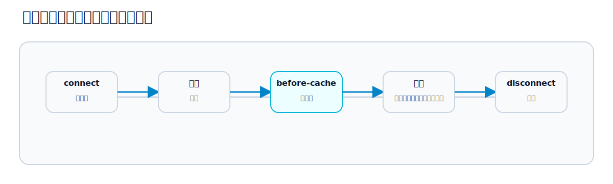

# 第22章 外部ライブラリと連携する

## この章のねらい

実務では、日付ピッカーやチャートなど、外部の JavaScript ライブラリを使いたくなります。Stimulus は、こうしたライブラリを「いつ初期化し、いつ破棄するか」を管理する、ちょうどよい器になります。

ただし、Turbo を使うアプリでは注意が要ります。Turbo は画面を差し替え、キャッシュします。外部ライブラリを素朴に初期化すると、差し替えやキャッシュのたびに二重に初期化されたり、後始末されずに残ったりします。

この章では、外部ライブラリを `connect()` / `disconnect()` で安全に扱い、Turbo のキャッシュと共存させる方法を学びます。第6部の締めです。

## 22.1 connect / disconnect でライフサイクルに合わせる

外部ライブラリ連携の基本は、第19章で見た `connect()` と `disconnect()` に、初期化と破棄を合わせることです。

- `connect()` … ライブラリを初期化する
- `disconnect()` … ライブラリを破棄する

`connect()` だけ書いて `disconnect()` を書かないと、要素が消えてもライブラリが残り続けます。Turbo は画面を何度も差し替えるので、これが積もると問題になります。<strong>初期化したら、必ず破棄する</strong>。これが鉄則です。

## 22.2 動的 DOM と再接続

なぜ破棄がそれほど大事なのでしょうか。第19章で見たとおり、Stimulus の `connect()` は、Turbo の差し替えのたびに呼ばれます。

たとえば、一覧と詳細を行き来すると、そのたびに詳細の `connect()` が走ります。`connect()` でライブラリを初期化していれば、行き来のたびに初期化されます。`disconnect()` で破棄していないと、前の初期化が残ったまま、新しい初期化が重なります。これが二重初期化です。

Turbo は素の DOM を差し替えます。ライブラリが作った内部状態や、要素の外に追加した DOM（ポップアップなど）は、Turbo は知りません。だから、`disconnect()` で自分で片付ける必要があります。

## 22.3 chart / date picker の例

チャートライブラリ（ここでは Chart.js を例にします）を Stimulus で包みます。

`app/javascript/controllers/chart_controller.js`

```javascript
import { Controller } from "@hotwired/stimulus"
import Chart from "chart.js/auto"

export default class extends Controller {
  connect() {
    this.chart = new Chart(this.element, {
      type: "bar",
      data: { /* ... */ }
    })
  }

  disconnect() {
    this.chart.destroy()
  }
}
```

`connect()` でチャートを生成し、インスタンスを `this.chart` に持っておきます。`disconnect()` で、そのインスタンスの `destroy()` を呼んで破棄します。これで、画面を何度行き来しても、チャートは毎回きれいに作り直され、残骸も残りません。

なお Chart.js は `<canvas>` 要素に描画します。この controller は `<canvas data-controller="chart">` のように、canvas へ結びつける前提です（`this.element` が canvas になります）。

日付ピッカーも同じ形です。`connect()` で入力欄にピッカーを初期化し、`disconnect()` でピッカーを破棄します。ライブラリによっては、ポップアップを `<body>` 直下に追加するものがあります。その場合、要素を消すだけではポップアップが残るので、`disconnect()` での破棄がいっそう重要です。

## 22.4 cleanup

`disconnect()` で破棄するもの、というのは、具体的には次のようなものです。

- ライブラリのインスタンス（`destroy()` などで）
- 自分で登録したタイマー（`clearTimeout` / `clearInterval`）
- 自分で `window` や `document` に登録したイベントリスナー（`removeEventListener`）
- 要素の外に追加した DOM

第21章のトーストでも、`disconnect()` で `clearTimeout` していました。`connect()` で何かを始めたら、それを `disconnect()` で止める、と対にして考えます。

## 22.5 Turbo cache との相互作用




もう 1 つ、キャッシュ特有の注意があります。第9章で見たとおり、Turbo はページを離れる直前にスナップショットを保存し、戻る・進むでプレビュー表示します。

ここで問題になるのは、<strong>スナップショットが保存されるのは、要素が消える前（つまり `disconnect()` より前）</strong>だということです。ライブラリが要素の中の DOM を大きく書き換えていると、その書き換え後の状態がスナップショットに焼き付きます。戻ってきたとき、その焼き付いた DOM の上で `connect()` がもう一度走り、見た目が壊れることがあります。

これを防ぐには、スナップショット保存の直前に、DOM を初期状態へ戻します。`turbo:before-cache` イベントで行います。

```javascript
import { Controller } from "@hotwired/stimulus"

export default class extends Controller {
  connect() {
    this.beforeCache = () => this.teardown()
    document.addEventListener("turbo:before-cache", this.beforeCache)
    this.setup()
  }

  disconnect() {
    document.removeEventListener("turbo:before-cache", this.beforeCache)
    this.teardown()
  }

  setup() { /* ライブラリの初期化 */ }
  teardown() { /* ライブラリの破棄と DOM の復元 */ }
}
```

`turbo:before-cache` で `teardown()` を呼び、スナップショットには初期化前のきれいな DOM が入るようにします。これで、プレビュー表示で壊れた見た目が出るのを防げます。第9章で「外部ライブラリは第22章で扱う」と送っていたのが、この後始末です。

## 22.6 importmap での外部ライブラリ読み込み

最後に、外部ライブラリの読み込みです。第6章で見たとおり、本書は importmap を使います。外部ライブラリは、公開された ES モジュールを pin して読み込みます。

```bash
bin/importmap pin chart.js
```

これで `config/importmap.rb` に pin が追加され、`import Chart from "chart.js/auto"` のように読み込めます。ライブラリによっては依存パッケージを伴います（Chart.js も内部で別パッケージに依存します）。`bin/importmap pin` は依存も含めて pin しようとしますが、実際にどう解決されたかは `bin/importmap json` で確認しておくと安全です。

ただし、第6章で触れた注意がここでも効きます。importmap が面倒を見るのは JavaScript だけです。<strong>ライブラリが必要とする CSS は、別途読み込みます</strong>。日付ピッカーのように見た目を持つライブラリでは、CSS の読み込みを忘れると、機能はしても見た目が崩れます。また、ES モジュールとして配信されていないライブラリは、importmap では扱いにくいことがあります。その場合は、第6章で触れた jsbundling 構成が選択肢になります。

> 第22章で、第6部を締めます。Stimulus を「HTML に振る舞いを足す小さな JavaScript」として学び、controller・action・target、Values・Classes・Outlets、そして外部ライブラリとの安全な連携まで見ました。次の第7部では、ここまでの Turbo と Stimulus を組み合わせて、検索・ページネーション・モーダル・通知といった実務的な UI を作ります。

## 参考資料

- Stimulus リファレンス（Lifecycle Callbacks）: <https://stimulus.hotwired.dev/reference/lifecycle-callbacks>
- Turbo のイベントリファレンス: <https://turbo.hotwired.dev/reference/events>
- Rails ガイド「Rails で JavaScript を扱う」: <https://guides.rubyonrails.org/working_with_javascript_in_rails.html>
