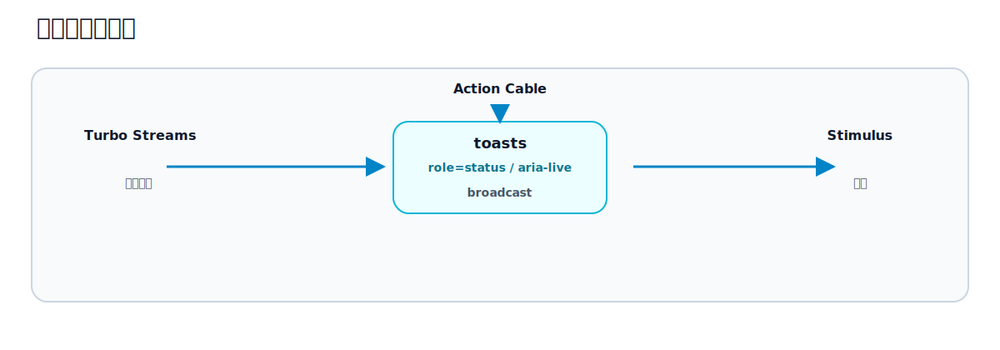

# 第27章 通知、トースト、フラッシュメッセージ

## この章のねらい

第7部の締めは、通知です。操作の結果を伝えるフラッシュ、少し経つと消えるトースト、そして他のユーザーの操作を知らせるリアルタイム通知。

この章は、これまで学んだものの合わせ技です。Turbo Streams で差し込み、Stimulus で演出し、Action Cable で配信します。第5部・第6部・第18章が、ここで一つにつながります。

## 27.1 完成イメージ

操作するとトーストが画面の隅に出て、数秒後に自動で消えます。閉じるボタンでも消せます。複数の通知は積み重なります。さらに、他のユーザーが自分にタスクを割り当てると、その通知がリアルタイムで届きます。

## 27.2 この章の選択




役割を 3 つに分けます。

- <strong>差し込み</strong>は Turbo Streams。通知を画面に足すのは、サーバーからの命令です（第5部）。
- <strong>演出</strong>は Stimulus。自動で消す、閉じる、フェードする、はサーバー往復の要らない振る舞いです（第6部）。
- <strong>他者発の配信</strong>は Action Cable。他のユーザーの操作をきっかけに届けるのは broadcast です（第18章）。

## 27.3 通常の flash を整理する

まず、フラッシュの置き場所を整えます。レイアウトに、フラッシュ用のコンテナを置きます。

`app/views/layouts/_flash.html.erb`

```erb
<% flash.each do |type, message| %>
  <div class="flash flash-<%= type %>"><%= message %></div>
<% end %>
```

`app/views/layouts/application.html.erb`（抜粋）

```erb
<div id="flash" role="status" aria-live="polite">
  <%= render "layouts/flash" %>
</div>
```

`id="flash"` で差し替えの宛先にし、`role="status"` / `aria-live="polite"` で読み上げ対象にします（第17章）。

## 27.4 Turbo Streams で flash 領域を更新する

ページ遷移しない操作では、第16章のとおり、Turbo Streams でこの `#flash` を更新します。

```erb
<%= turbo_stream.update "flash", partial: "layouts/flash" %>
```

controller では `flash.now` を使います（ページ遷移しないため、第16章）。これで、操作のたびにフラッシュがその場に出ます。

## 27.5 Stimulus で自動消滅・閉じる・transition

フラッシュを「少し経つと消えるトースト」にするのは、Stimulus の役割です。第21章で作ったトーストの controller を、閉じるボタンに対応させて使います。

`app/javascript/controllers/toast_controller.js`

```javascript
import { Controller } from "@hotwired/stimulus"

export default class extends Controller {
  static values = { delay: { type: Number, default: 5000 } }

  connect() {
    this.timeout = setTimeout(() => this.dismiss(), this.delayValue)
  }

  disconnect() {
    clearTimeout(this.timeout)
  }

  dismiss() {
    this.element.remove()
  }
}
```

```erb
<div data-controller="toast" data-toast-delay-value="5000">
  保存しました。
  <button type="button" data-action="toast#dismiss" aria-label="閉じる">×</button>
</div>
```

`connect()` でタイマーを仕掛け、時間が来たら `dismiss()` で消します。閉じるボタンからも `dismiss()` を呼べます。`disconnect()` でタイマーを片付けるのを忘れないでください（第22章）。消えるときにフェードさせたいなら、`dismiss()` で CSS のクラスを付け、`transitionend` を待ってから `remove()` する形にします。

## 27.6 複数通知のスタック管理

通知は、続けて起きると複数出ます。重ならないよう、積み重ねるコンテナを用意します。

`app/views/layouts/application.html.erb`（抜粋）

```erb
<div id="toasts" role="status" aria-live="polite"></div>
```

通知を出すときは、このコンテナにトーストを `append` します。

```erb
<%= turbo_stream.append "toasts", partial: "toasts/toast", locals: { message: "保存しました。" } %>
```

それぞれのトーストが自分の `toast` controller を持つので、各自が独立して時間で消えます。`#toasts` を `aria-live` 領域にしておけば、追加されたトーストが読み上げられます。

## 27.7 Action Cable でリアルタイム通知に拡張する

ここまでは「自分の操作」への通知でした。最後に、「他のユーザーの操作」への通知を足します。第18章の broadcast を使います。

各ユーザーのページが、自分宛ての通知を購読します。レイアウトに置きますが、未ログインのページでは `current_user` が `nil` になるので、ログイン時だけ描きます。

```erb
<% if current_user %>
  <%= turbo_stream_from current_user %>
<% end %>
```

そして、たとえばタスクが誰かに割り当てられたとき、その担当者へトーストを配信します。担当者は未割り当て（`nil`）のこともあるので、いるときだけ配信します。

```ruby
if task.assignee
  Turbo::StreamsChannel.broadcast_append_to(
    task.assignee,
    target: "toasts",
    partial: "toasts/toast",
    locals: { message: "新しいタスクが割り当てられました。" }
  )
end
```

`broadcast_append_to` で、担当者の `toasts` コンテナにトーストを追加します。これは、自分の操作で `append` するのと同じ仕組みで、経路が Action Cable になっただけです（第18章）。担当者の画面に、リアルタイムで通知が現れます。

## 27.8 a11y

通知は、見えるだけでなく伝わる必要があります。

- 通知のコンテナに `role="status"` / `aria-live="polite"` を付け、追加された通知が読み上げられるようにします。緊急性の高いものは `aria-live="assertive"` を検討しますが、多用は禁物です。
- <strong>自動で消える情報を、重要情報の唯一の伝達手段にしない</strong>。トーストは数秒で消えます。読み上げが追いつかないこともあります。「保存に失敗した」のような重要な情報は、トーストだけに頼らず、フォームのエラー（第25章）など消えない場所にも示します。

## 27.9 テスト

通知は、System Test で次を確かめます。

- 操作するとトーストが表示される
- 時間が経つ、または閉じるボタンで消える
- 続けて操作すると、複数のトーストが積み重なる

時間で消える挙動は、待ち時間を Values で短くしてテストするか、閉じるボタンでの消去を確認すると安定します。

## 27.10 アンチパターン

- <strong>重要情報をトーストだけに出す</strong>。消えると分からなくなります。消えない場所にも示します。
- <strong>`aria-live` がない</strong>。スクリーンリーダーに通知が届きません。
- <strong>無限に積もる</strong>。古いトーストを消さないと、画面が埋まります。自動消滅と、必要なら上限を設けます。
- <strong>見せてはいけない情報を broadcast する</strong>。配信先を誤ると、他人に通知が届きます。配信範囲と認可（第18章・第31章）に注意します。

> 第27章で、第7部を締めます。検索・ページネーション・フォーム UX・モーダル・通知という実務的な UI を、Turbo と Stimulus の組み合わせで作りました。Relay は実務水準の管理画面になりました。次の第8部では、こうして育てた Relay を、テスト・デバッグ・性能・セキュリティの面から保守します。

## 参考資料

- Turbo Streams リファレンス: <https://turbo.hotwired.dev/reference/streams>
- Rails ガイド「Action Cable の概要」: <https://guides.rubyonrails.org/action_cable_overview.html>
- Stimulus リファレンス（Values / Lifecycle）: <https://stimulus.hotwired.dev/reference/values>
- MDN: ARIA live regions: <https://developer.mozilla.org/en-US/docs/Web/Accessibility/ARIA/ARIA_Live_Regions>
