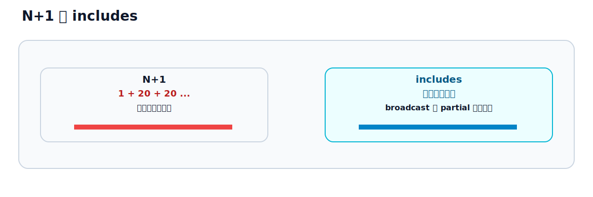

# 第30章 パフォーマンスと N+1

## この章のねらい

Hotwire は、画面を部分更新するので、体感が軽くなります。しかし、それは「サーバーが速い」という意味ではありません。サーバー側が遅ければ、部分更新であっても遅いままです。

この章では、Hotwire の体感速度を損なう Rails 側の問題を見つけて直します。とくに N+1 クエリは、Relay のような関連の多いアプリで起きやすい問題です。

## 30.1 Hotwire は遅い Rails を隠さない

第8部の軸を、ここで思い出します。「Hotwire は、遅い Rails も危ない Rails も隠してくれない」。

部分更新は、転送する HTML を小さくします。しかし、その HTML を作るのは Rails です。一覧を描くのに大量のクエリが走っていれば、frame でも stream でも、生成は遅いままです。Hotwire を入れたから速くなった、と安心せず、サーバー側の生成コストを測ります。

## 30.2 partial rendering のコスト

Relay の一覧は、`_task` partial をタスクの数だけ描きます。partial を 1 件ずつ描くのには、それなりのコストがあります。

Rails のコレクション描画（`render @tasks`）は、同じ partial を繰り返すときに最適化が効くので、1 件ずつ `render` を呼ぶより効率的です。一覧は、できるだけコレクション描画でまとめて描きます。それでも重いときは、30.5 のキャッシュを検討します。

## 30.3 N+1 と preload




Relay のタスクは、担当者（`assignee`）・タグ（`tags`）・コメント（`comments`）を持ちます。一覧で各タスクの担当者名やタグを表示すると、タスク 1 件ごとに関連を引くクエリが走ります。これが N+1 です。

たとえば、20 件のタスクを表示するのに、担当者を引くクエリが 20 回、タグを引くクエリが 20 回……と積み重なります。一覧の表示が、急に遅くなります。

直し方は、関連を先読み（preload）することです。`includes` を使います。

`app/controllers/tasks_controller.rb`（`index`）

```ruby
@tasks = Task.includes(:assignee, :tags).order(:id)
```

`includes(:assignee, :tags)` を付けると、担当者とタグをまとめて読み込み、N+1 が解消します。一覧で使う関連を、`includes` で先読みします。

コメントは少し事情が違います。一覧に出したいのが「コメント件数」だけなら、`includes(:comments)` でコメント本体を全部読み込むのは無駄です。件数用途では、`counter_cache`（件数をカラムに持たせる仕組み）を使うのが効率的です。一覧で本文まで使うなら先読みする、件数だけなら `counter_cache`、と用途で使い分けます。

ここで大事なのは、第18章で触れた点です。<strong>broadcast の partial でも N+1 は起きます</strong>。配信のたびに関連を引けば、配信が遅くなります。配信に使う partial でも、必要な関連を先読みします。

## 30.4 broadcast の回数

リアルタイム更新（第18章）は、配信の回数にも気を配ります。

`broadcasts_to` は、レコードの保存ごとに配信します。たくさんのレコードを次々に保存する処理では、そのたびに配信が走り、サーバーにもクライアントにも負荷がかかります。

- 重い配信は、非同期版（`broadcast_*_later_to`）でジョブに逃がします（第18章）。
- 大量の更新を一度にするなら、1 件ずつの配信ではなく、「最新に揃えて」と伝える broadcast refresh（第9章・第15章）を検討します。

## 30.5 キャッシュの使いどころ

描画そのものを減らすには、フラグメントキャッシュが効きます。partial の描画結果をキャッシュし、変わっていなければ作り直しません。

```erb
<% cache task do %>
  <%= render task %>
<% end %>
```

`cache task` は、`task` のキャッシュキー（更新時刻を含む）でキャッシュします。タスクが変わればキーが変わり、自動でキャッシュが切り替わります。一覧と部分更新で同じ partial を共通化してあれば（第12章・第17章）、どちらの描画でも同じキャッシュが効きます。partial の共通化は、保守だけでなく、キャッシュの面でも利きます。

## 30.6 大きすぎる Turbo Streams

Turbo Streams は、1 レスポンスに複数の命令を入れられます（第15章・第17章）。便利ですが、入れすぎると重くなります。

たとえば、一度に何百行も append する命令を返すと、サーバーの描画も、ブラウザの適用も重くなります。大量のデータは、ページネーション（第24章）で分けて送ります。1 レスポンスの命令は、必要な分にとどめます。

## 30.7 測定してから直す

最後に、いちばん大事な原則です。<strong>推測で直さず、測ってから直します。</strong>

- サーバーログを見れば、1 リクエストで走ったクエリの数と時間が分かります。N+1 は、同じようなクエリが並ぶので、ログで見つけられます。
- N+1 を自動で検出する gem（Bullet など）を開発環境に入れると、見落としを減らせます。
- どこが遅いかは、プロファイラ（rack-mini-profiler など）で測ります。

「ここが遅いはず」という思い込みで `includes` を撒くと、かえって無駄な読み込みが増えることもあります。測って、遅い箇所を特定してから直す。これが順序です。

> 第30章では、Hotwire の体感を支える Rails 側の性能を扱いました。次の第31章では、部分更新や broadcast でも認可を崩さないための、認証・認可・セキュリティを学び、第8部を締めます。

## 参考資料

- Rails ガイド「Active Record クエリインターフェイス」: <https://guides.rubyonrails.org/active_record_querying.html>
- Rails ガイド「Rails のキャッシュ機構」: <https://guides.rubyonrails.org/caching_with_rails.html>
- Rails ガイド「Active Support の Instrumentation」: <https://guides.rubyonrails.org/active_support_instrumentation.html>
