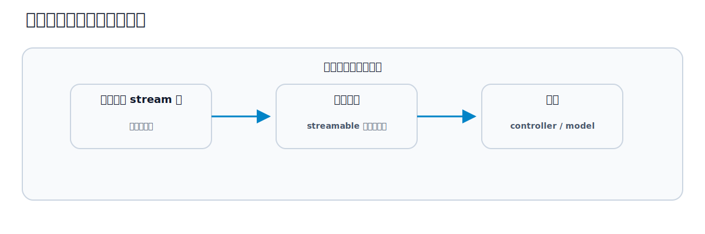

# 第31章 認証、認可、セキュリティ

## この章のねらい

Hotwire は、画面の更新方法を変えますが、セキュリティの責任は変えません。部分更新でも broadcast でも、「誰が何をしてよいか」を守るのは、通常の Rails と同じです。

この章では、Hotwire を使うときに崩しやすい認可の落とし穴と、その守り方を学びます。第8部の軸「Hotwire は危ない Rails を隠さない」の総仕上げです。本書のサンプル Relay は単一チーム前提なので、ここは要点を押さえる範囲にとどめ、考え方を示します。

## 31.1 controller の認可を省略しない

Hotwire を使っても、リクエストは controller を通ります。frame の読み込みも、Turbo Streams を返す送信も、すべて通常の controller アクションです。

だから、認可は controller で行います。「ログインしているか」「その操作をしてよいユーザーか」を、これまでどおり controller で確認します。Hotwire だから特別なことをする、のではありません。むしろ、<strong>Hotwire だからといって認可を省略してよい場所は 1 つもありません</strong>。

## 31.2 Frame / Stream でも権限を確認する

つまずきやすいのは、「これは部分的な HTML だから」と気を抜くことです。

frame の `src` が指すアクションも、Turbo Streams を返すアクションも、独立したリクエストです。一覧ページで認可していても、frame が読み込むアクションを直接叩かれたら、そのアクションが無防備なら通ってしまいます。

部分を返すアクションにも、ページを返すアクションと同じ認可をかけます。「ページ全体は守ったから安心」ではなく、「部分を返す入口も同じく守る」と考えます。

## 31.3 broadcast の配信範囲

リアルタイム更新（第18章）では、配信範囲が認可と直結します。

broadcast は、購読している全員に届きます。配信先（streamable）を広く取りすぎると、見せてはいけない相手にまで更新が飛びます。たとえば、あるプロジェクトの更新を全ユーザー共通の配信先に流せば、無関係なユーザーにも届きます。

配信先は、「その更新を見てよい範囲」に合わせます。プロジェクト単位で見せるなら、プロジェクトを配信先にします。そして、<strong>配信する内容に、見せてはいけない情報を含めない</strong>。配信は受け取った全員の画面に出ることを、常に意識します。

## 31.4 署名付き stream 名への購読

ここで、誤解しやすい点をはっきりさせます。`turbo_stream_from` が作る購読名は、署名されています。これは購読名の改ざんを防ぐもので、第三者が購読名を推測・改変して別の配信を盗み聞きすることを、難しくします。

しかし、これは<strong>認可ではありません</strong>。署名は「購読名が正規のものか」を保証するだけで、「そのユーザーがそれを見てよいか」は判断しません。

アクセス制御は、別途行います。見てよいユーザーにだけ `turbo_stream_from` を描く（第27章で `current_user` がいるときだけ購読したのも、その一例）、配信内容に秘密情報を含めない、配信元の controller / model で権限を確認する。署名はその上での、改ざん防止の一枚です。

## 31.5 CSRF とフォーム

Rails は、フォーム送信に対する CSRF 保護を備えています。Hotwire でも、これは効いています。

`form_with` で作ったフォームには、CSRF トークンが埋め込まれます。Turbo は、フォーム送信のとき、このトークンを含めて送ります。だから、これまで作ってきたフォームは、特別なことをしなくても CSRF 保護の下にあります。

注意が要るのは、フォームを使わず、自分で `fetch` などを書いてサーバーを叩く場合です。そのときは、`csrf-token` の meta タグ（レイアウトの `csrf_meta_tags` が生成します）からトークンを読み、自分でリクエストに含める必要があります。フォームと Turbo に任せている限りは、保護は自動で効きます。

## 31.6 ユーザーごとの DOM id

第17章で、`dom_id` を使って `id` を付けました。`dom_id(task)` は `"task_1"` のような、推測しやすい `id` です。

ここに、油断の余地があります。`id` が推測できるからといって、認可をその曖昧さに頼ってはいけません。「`id` が分からないから安全」は、守りになりません。`id` を推測されても問題ないよう、controller で認可します。

ユーザーごとに分けたい配信では、推測しやすい共通の `id` ではなく、署名付きの stream 名（31.4）で購読を分けます。`id` の付け方そのものは推測されうる前提で、その上で認可と署名で守る、と考えます。

## 31.7 第18章との責務分担

第18章では、broadcast の「仕組み」を扱いました。`turbo_stream_from` で購読し、`broadcasts_to` や `broadcast_*_to` で配信する、という配信の仕方です。

この章は、その上の「責任」を扱いました。配信先を正しく絞る、内容に秘密を含めない、署名は認可ではないと理解する、controller で認可する。仕組みが分かったうえで、誰に何を届けてよいかを設計するのが、この章の役割です。

Relay は単一チーム前提なので、実装は最小限です。しかし、マルチテナントや権限の分かれるアプリでは、ここが設計の中心になります。Hotwire の部分更新・broadcast を足しても、認可の原則は変わらない。これが、第8部を通じての結論です。

> 第31章で、第8部を締めます。テスト・デバッグ・性能・セキュリティと、育てた Relay を保守する観点を見てきました。次の第9部では、この Relay を、書き直さずにモバイルへ広げる Hotwire Native を学びます。

## 参考資料

- Rails セキュリティガイド: <https://guides.rubyonrails.org/security.html>
- Rails ガイド「Action Cable の概要」: <https://guides.rubyonrails.org/action_cable_overview.html>
- turbo-rails（Streams / Broadcastable）: <https://github.com/hotwired/turbo-rails>
