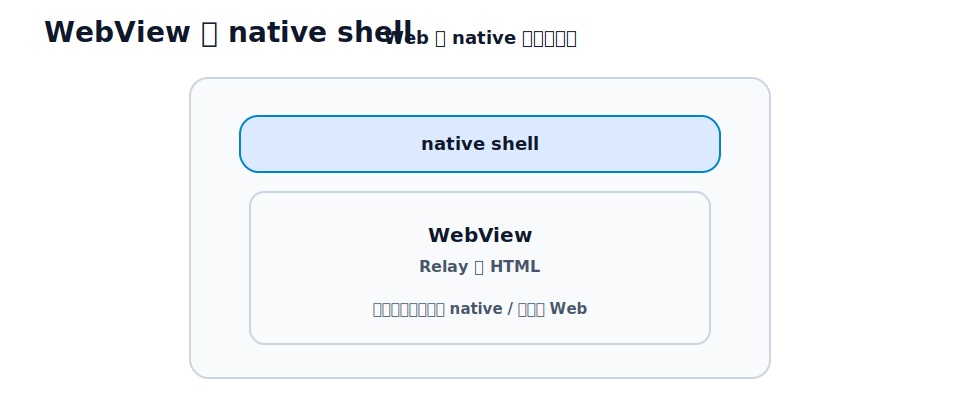

# 第32章 Hotwire Native の考え方

## この章のねらい

ここまで育てた Relay は、Web アプリです。Hotwire Native を使うと、この Web アプリを書き直さずに、iOS / Android のモバイルアプリへ広げられます。

第9部では、その考え方を学びます。実機でビルドする手順（Xcode / Android Studio が必要です）は付録Hに分けてあるので、ネイティブ開発環境がなくても、この部は読み進められます。

> この部を貫く軸は「同じ Relay を、ネイティブの殻で包む」です。Hotwire Native は、既存の Web 画面をそのまま表示し、必要な部分だけネイティブに置き換える、Web-first な構成です。

## 32.1 Hotwire Native とは

Hotwire Native は、モバイルアプリの作り方の一つです。アプリの画面の多くを、サーバーが返す Web 画面（HTML）で構成し、それをネイティブアプリの中で表示します。

ふつう「ネイティブアプリ」というと、画面を一つひとつネイティブのコードで作ります。Hotwire Native は、その逆の発想です。<strong>すでにある Web 画面を活かし、ネイティブはそれを包む殻として使う</strong>。だから、Relay のように Web で作り込んだアプリを、最小限の追加でモバイルに持っていけます。

Web を主役にするので、機能の追加・修正は、これまでどおりサーバー側で行えます。Web 画面については、アプリをストアに出し直さなくても、Web を更新すれば、モバイルの表示も変わります。これが Web-first の利点です。

ただし、これは Web 画面に限った話です。native shell そのものや、後の章で扱うネイティブ画面・Bridge Components を変えるときは、アプリをビルドし直し、ストアで配信（再申請）する必要があります。「Web で済む部分はストアを介さず更新でき、ネイティブの部分はストア配信が要る」と区別して覚えてください。

## 32.2 WebView と native shell

Hotwire Native のアプリは、大きく 2 つの部分でできています。

- <strong>WebView</strong> … Web 画面（Relay の HTML）を表示する部分。中身は、これまで作ってきた Web そのものです。
- <strong>native shell（ネイティブの殻）</strong> … WebView を包む、ネイティブの枠組み。画面遷移（ナビゲーションバーや戻る操作）、タブ、画面の出し方（プッシュ遷移かモーダルか）などを、ネイティブとして提供します。

ユーザーから見ると、ナビゲーションや遷移はネイティブの操作感で、中身の画面は Web、という形になります。Turbo が Web で実現していた高速な画面遷移が、ネイティブのナビゲーションと組み合わさります。

## 32.3 すべてをネイティブ化しない判断

Hotwire Native の肝は、「どこまで Web のままにし、どこをネイティブにするか」の判断です。

すべてをネイティブのコードで作り直すと、Web-first の利点（更新の速さ、コードの共有）が消えます。一方で、Web だけでは難しい部分もあります。カメラ、決済、プッシュ通知、複雑なジェスチャーなどです。

考え方は、こうです。<strong>原則は Web のまま。ネイティブでしか作れない、あるいはネイティブの方が明らかに良い部分だけを、ネイティブにする。</strong>多くの画面は Web のままで十分です。Relay のタスク一覧や詳細、フォームは、Web のまま動きます。

## 32.4 Web 側に求められる設計

Web を主役にする以上、Web 側の品質が、そのままモバイルの品質になります。Hotwire Native のために、Web 側に求められることがあります。

- <strong>レスポンシブ</strong>。モバイルの画面幅で、きちんと見える・操作できること。
- <strong>素直なナビゲーション</strong>。リンクと遷移が、ネイティブの画面スタックに自然に乗ること。URL と画面状態が対応していること（第14章）。
- <strong>認証の共有</strong>。WebView は Web のセッションを使います。Web 側のログイン（第5章）が、そのままモバイルでも効きます。

ここで効いてくるのが、第7部までの作り込みです。フォームの UX、モーダル、通知を Web できちんと作ってあれば、その多くはモバイルでもそのまま活きます。<strong>Web の HTML が整っているほど、ネイティブ化の追加コストは小さくなります。</strong>

## 32.5 iOS / Android の大まかな違い

Hotwire Native は、iOS と Android の両方に対応します。

- iOS … Swift で書きます。
- Android … Kotlin で書きます。

native shell のコードは、それぞれのネイティブ言語で書くので、言語と細部は異なります。しかし、考え方（WebView ＋ native shell、Path Configuration、Bridge Components）は共通です。本書では、両方に共通する考え方を中心に扱います。具体的なセットアップとコードは、付録Hで扱います。

> 第32章では、Hotwire Native の全体像を、Web-first という考え方で押さえました。次の第33章では、URL ごとに画面の出し方を決める Path Configuration を学びます。

## 参考資料

- Hotwire Native: <https://native.hotwired.dev/>
- Hotwire: <https://hotwired.dev/>
