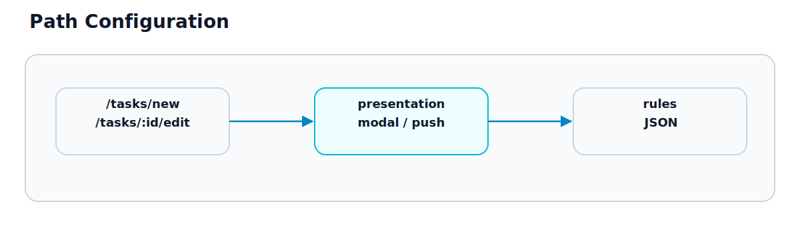

# 第33章 Path Configuration

## この章のねらい

第32章で、Hotwire Native は Web 画面を native shell で包む、と学びました。では、「この URL はモーダルで開く」「この URL はプッシュ遷移する」といった、ネイティブの見せ方は、どこで決めるのでしょうか。

それを担うのが Path Configuration です。この章では、URL ごとに画面の出し方を決める仕組みと、その考え方を学びます。

## 33.1 Path Configuration の役割

Path Configuration は、<strong>URL のパターンごとに、ネイティブでの見せ方を対応づける設定</strong>です。JSON で書きます。

native shell は、WebView が URL を開こうとするたびに、この設定を見ます。そして、「この URL はモーダルで」「この URL は通常のプッシュ遷移で」と、設定に従って画面を出します。Web 側のコードを変えずに、ネイティブの振る舞いを URL 単位で制御できる、というのが役割です。

## 33.2 URL pattern

設定は、ルール（rules）の集まりです。各ルールは、URL のパターンと、その振る舞い（プロパティ）を持ちます。パターンは、パスに対する正規表現で書きます。

```json
{
  "settings": {},
  "rules": [
    {
      "patterns": ["/tasks/new", "/tasks/\\d+/edit"],
      "properties": { "context": "modal" }
    }
  ]
}
```

この例では、`/tasks/new` と `/tasks/123/edit` のようなパスに、あるプロパティを当てています。パターンに当てはまらない URL は、既定の振る舞い（通常のプッシュ遷移）になります。なお、`properties` の中身（`context` などのキー名や値）は、ここでは構造を示すための例です。実際に使えるキーと値は 33.3 と公式ドキュメント（付録H）で確認してください。

## 33.3 presentation




ルールのプロパティで、画面の出し方を指定します。代表的なのが、モーダルで出すか、プッシュで出すか、です。

上の例の `"context": "modal"` は、その URL をモーダルとして出す指定です。タスクの新規作成や編集を、モーダルで重ねて表示できます。指定がなければ、画面はナビゲーションに積まれる通常のプッシュ遷移になります。

プロパティの正確なキー名や指定できる値は、Hotwire Native のバージョンによって異なります。本書では考え方を示すにとどめ、実際のキー名と値は公式ドキュメントと付録Hで確認します。大切なのは、「URL に対して見せ方を割り当てる」という構造です。

## 33.4 rules の管理

Path Configuration は、アプリに同梱することも、サーバーから配信することもできます。

サーバーから配信すると、アプリをストアに出し直さずに、ルールを更新できます。「この画面はモーダルに変えたい」と思ったとき、サーバー側の設定を変えるだけで、配布済みのアプリの振る舞いを変えられます。第32章で見た「Web で済む部分はストアを介さず更新できる」という利点が、ここにも及びます。

ただし、これはあくまでルール（見せ方の対応づけ）の更新です。native shell の機能そのものを変えるなら、アプリの再配信が要ります（第32章）。

## 33.5 Web 側ルーティングとの関係

Path Configuration は、URL のパターンで振る舞いを決めます。つまり、<strong>Web 側の URL 設計が、そのままネイティブの制御の土台になります</strong>。

URL が素直に設計されていれば、パターンも素直に書けます。逆に、URL と画面の状態がずれていると（第14章）、パターンでの制御が難しくなります。たとえば、モーダルで開きたい画面が `/tasks/new` のような明確な URL を持っていれば、そこにモーダルの指定を当てるだけです。

ここで、第7部の第26章とつながります。モーダルを「URL を持つ画面」として設計しておくか（ディープリンク）、URL を変えずに開くか、という判断が、ネイティブでの制御のしやすさにも効きます。Web の URL 設計は、ネイティブのためにも効いてくるのです。

> 第33章では、URL ごとに見せ方を決める Path Configuration を学びました。次の第34章では、Web とネイティブの境界をつなぐ Bridge Components を学びます。

## 参考資料

- Hotwire Native: <https://native.hotwired.dev/>
- Hotwire Native（Path Configuration）: <https://native.hotwired.dev/>
