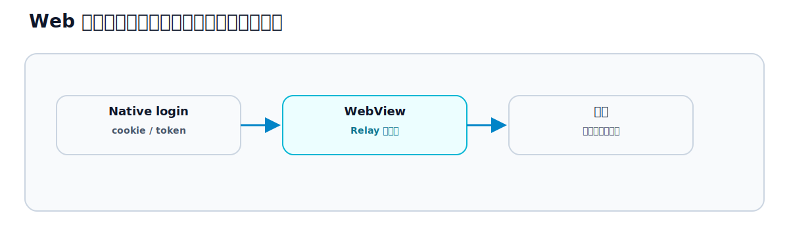

# 第35章 Native Screens

## この章のねらい

第33章・第34章では、Web 画面を土台に、見せ方（Path Configuration）と部品（Bridge Components）をネイティブで補いました。しかし、ときには画面そのものを、丸ごとネイティブで作る方がよい場面もあります。

それが Native Screens です。この章では、ネイティブ画面が必要になる場面と、Web 画面との責務分担を学び、第9部を締めます。

## 35.1 Native Screens とは

Native Screens は、WebView を使わず、<strong>完全にネイティブのコードで作る画面</strong>です。iOS なら Swift、Android なら Kotlin で、画面を一から組みます。

これは、Hotwire Native の Web-first の例外です。原則は Web 画面ですが、Web では難しい・ネイティブの方が明らかに良い画面だけ、ネイティブで作ります。Web 画面とネイティブ画面が、同じアプリのナビゲーションの中に混在する形になります。

## 35.2 ログイン、決済、カメラなどの候補

ネイティブ画面が向くのは、次のような画面です。

- <strong>カメラ・センサー</strong>。カメラ撮影や位置情報など、デバイスの機能を深く使う画面。
- <strong>決済</strong>。Apple Pay や Google Pay、ストアの課金など、ネイティブの仕組みが要る決済。
- <strong>ログイン</strong>。生体認証（指紋・顔）や、ネイティブのパスワード管理と連携したいログイン。

逆に言えば、それ以外の多くの画面は Web のままで十分です。Relay のタスク管理の中心は、Web 画面で動きます。ネイティブ画面は、「Web では届かない」ところに絞ります。

## 35.3 WebView へ戻る導線

ネイティブ画面と Web 画面が混在するので、両者を行き来する導線が要ります。

たとえば、ネイティブのログイン画面でログインしたあと、Web のタスク一覧へ進む。あるいは、Web の画面からネイティブのカメラ画面を開き、撮影が終わったら Web へ戻る。こうした遷移を、native shell のナビゲーションの中で設計します。

ユーザーから見ると、ネイティブ画面も Web 画面も、同じアプリの中の画面です。境目を感じさせない遷移にするのが理想です。

## 35.4 状態同期

ネイティブ画面と Web 画面が混在するとき、いちばん注意が要るのが<strong>状態の同期</strong>、とくに認証です。

たとえば、ネイティブのログイン画面で認証したとします。その結果（ログイン済みであること）を、Web 側の WebView にも引き継がないと、Web 画面では「ログインしていない」ことになってしまいます。

WebView は、Web のセッション（cookie）を使います（第32章）。だから、ネイティブで認証した結果を、WebView のセッションに反映する受け渡しが要ります。ここは、第31章で見た認証・セキュリティの考え方が、ネイティブとの境界でも問われる場面です。トークンやセッションの受け渡しを、安全に設計します。具体的な受け渡しの仕組み（cookie やトークンを WebView にどう渡すか）は実装寄りの話なので、付録Hで扱います。

## 35.5 テストと配布の注意点

ネイティブ画面は、アプリのバイナリの一部です。ここから、Web 画面とは違う制約が生まれます。

- <strong>配布</strong>。ネイティブ画面を追加・修正したら、アプリをビルドし直し、ストアで配信（審査）します。Web 画面のように、サーバーを更新して即反映、とはいきません（第32章）。更新サイクルが、Web より遅く・重くなります。
- <strong>テスト</strong>。ネイティブ画面のテストは、ネイティブのテスト（iOS / Android のテスト）になります。Web 側の System Test（第28章）とは別の仕組みです。

だからこそ、ネイティブ画面は最小限にします。ネイティブ画面が増えるほど、Web-first の利点（速い更新サイクル、Web に寄せたテスト）が薄れ、ふつうのネイティブアプリ開発に近づいていきます。「本当にネイティブでなければならないか」を、配布とテストのコストまで含めて判断します。

> 第35章で、第9部を締めます。Hotwire Native を、Web-first という一貫した考え方で見てきました。Path Configuration で見せ方を決め、Bridge Components で部品を補い、どうしても必要なところだけ Native Screens にする。Web の Relay を土台に、モバイルへ無理なく広げられます。実機でのビルドは、付録Hで扱います。次の第10部では、ここまでの全体を振り返り、「Hotwire を選ぶべきか」を考えます。

## 参考資料

- Hotwire Native: <https://native.hotwired.dev/>
- Rails セキュリティガイド（認証）: <https://guides.rubyonrails.org/security.html>
